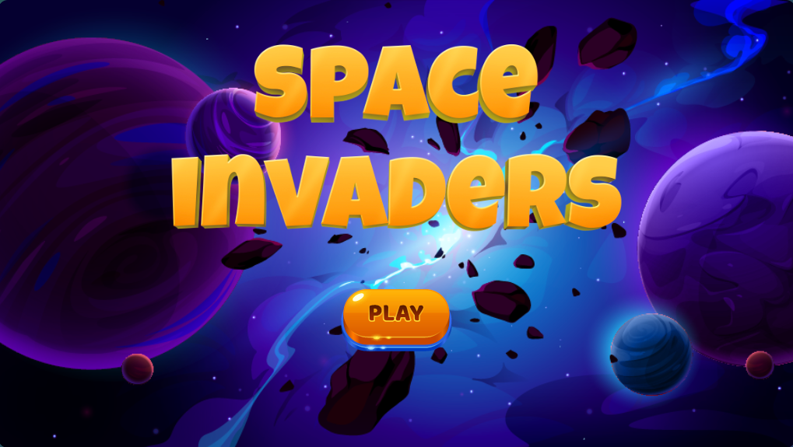

# Space Invaders Game

This is an adaptation of the renowned Space Invaders game. The game has been modified and refined to align more closely with my design preferences and desired game play experience. It includes several JavaScript files and an HTML file.

## Getting Started

To play the game, follow these instructions:

1. Open the `index.html` file in a web browser.
2. The game will start on the start screen, which displays the game title and a start button.
3. Click on the start button to begin the game.
4. Use the left and right arrow keys or the "A" and "D" keys to move the player spaceship horizontally.
5. Press the spacebar to shoot projectiles and destroy the enemy invaders.
6. The game ends when the enemy invaders reach the bottom of the screen or collide with the player spaceship.
7. If the game ends, a game over screen will be displayed, showing the final score.
8. To restart the game, click on the restart button on the game over screen.

## Files

The game consists of the following files:

- `index.html`: The HTML file that contains the structure and layout of the game interface.
- `index.js`: The JavaScript file that handles the game logic, player controls, and animation.
- `grid.js`: The JavaScript file that defines the Grid class responsible for managing the enemy invaders' movement and behavior.
- `invader-projectile.js`: The JavaScript file that defines the InvaderProjectile class representing projectiles fired by the enemy invaders.
- `invader.js`: The JavaScript file that defines the Invader class representing the enemy invaders.
- `particle.js`: The JavaScript file that defines the Particle class for creating visual effect particles.
- `player.js`: The JavaScript file that defines the Player class representing the player's spaceship.
- `projectile.js`: The JavaScript file that defines the Projectile class representing the player's projectiles.
- `audio.js`: The JavaScript file that handles the game's audio effects using the Howler library.

## Styling

The game interface is styled using CSS embedded within the `index.html` file. The CSS defines the appearance of various elements, such as the background, buttons, and text.

## External Dependencies

The game utilizes the following external libraries:

- [GSAP](https://greensock.com/gsap/): A JavaScript animation library used for animating elements in the game.
- [Howler](https://howlerjs.com/): A JavaScript audio library used for playing audio effects in the game.

The necessary library files are included in the `index.html` file using CDN links.

## Credits

- The initial version of the game was developed by following an online tutorial authored by Christopher Lis. The tutorial can be found at <https://chriscourses.com/courses>.
- Subsequent modifications and refinements were made by the developer to align with their design preferences and desired game play experience.

Please note that this game is provided for educational and entertainment purposes only.
